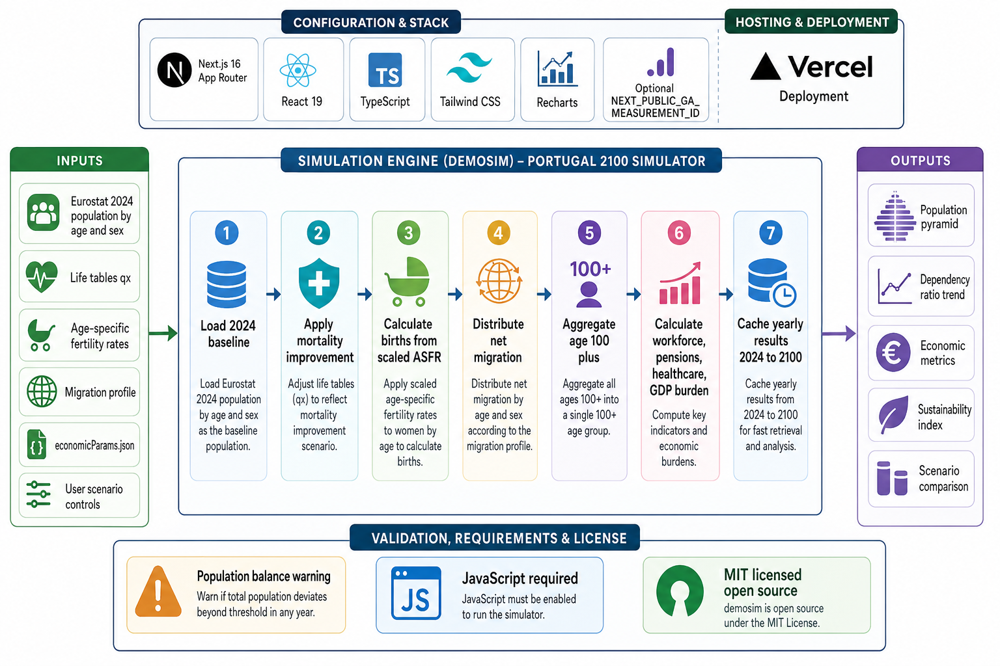

<div align="center">
  

  **📊 Explore Portugal's demographic future from 2026 to 2100 with real-time economic impact projections 🇵🇹**

  [Live Demo](https://demosim.tsilva.eu)
</div>

demosim is an interactive Next.js simulator for Portugal's population and economic pressure through 2100. It starts from INE's revised 31 December 2025 resident population and follows EUROPOP2025 fertility, mortality, and migration assumptions in a cohort-component projection model.

Use it to adjust fertility, migration, mortality improvement, retirement age, and workforce assumptions, then compare how those choices change Portugal's long-term demographic path.

## Install

```bash
git clone git@github.com:tsilva/demosim.git
cd demosim
corepack enable
pnpm install
pnpm dev
```

Open [http://localhost:3000](http://localhost:3000).

## Commands

```bash
pnpm install   # install dependencies
pnpm dev       # start the Next.js dev server
pnpm build     # build production output
pnpm start     # serve the production build
pnpm preview   # alias for pnpm start
```

## Notes

- `pnpm` is required. The repo has a `preinstall` guard and declares `pnpm@10.27.0` in `package.json`.
- The app requires JavaScript in the browser.
- `NEXT_PUBLIC_GA_MEASUREMENT_ID` is optional. When present, the app loads Google Analytics and tracks page views plus simulator interactions.
- Runtime data lives in `data/`: the revised 2026 opening population, an exact annual EUROPOP2025 snapshot, and officially calibrated economic assumptions.
- Refresh EUROPOP data with `pnpm data:update:europop`. The generator rejects a snapshot unless every published cohort transition and birth total reproduces with zero rounding error.
- Age `100+` is an open cohort, matching Eurostat's published projection structure. The engine checks population balance every projected year in development.
- Deployment metadata is included for Vercel as a Next.js app.

## Data Baseline

| Metric | Baseline value |
| --- | --- |
| Population (1 January 2026) | 11,424,031 |
| Median age (31 December 2025) | 45.8 |
| Life expectancy anchor (2024) | 82.5 overall, 79.7 male, 85.2 female |
| Baseline TFR assumption (2026) | 1.465 |
| Baseline net migration assumption (2026) | +132,517 |
| Normal retirement age (2026) | 66 years, 9 months |

Preset demographic paths use exact annual EUROPOP2025 baseline and sensitivity assumptions. Presets also follow the enacted 2027 retirement age and the EC current-policy path thereafter. The 2026 fiscal opening matches CFP 2025 execution and Eurostat SHA aggregates; later monetary outputs are reported in constant 2025 EUR. EC fiscal reference paths end in 2070, so 2071–2100 retains the final published spending share and varies it with each scenario's demographic exposure.

## Architecture



## License

[MIT](LICENSE)
